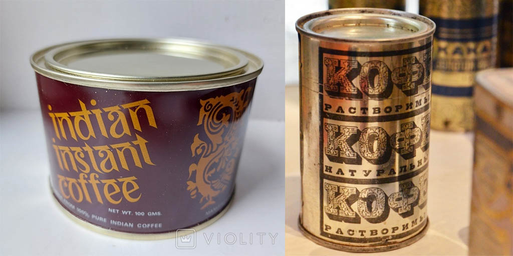
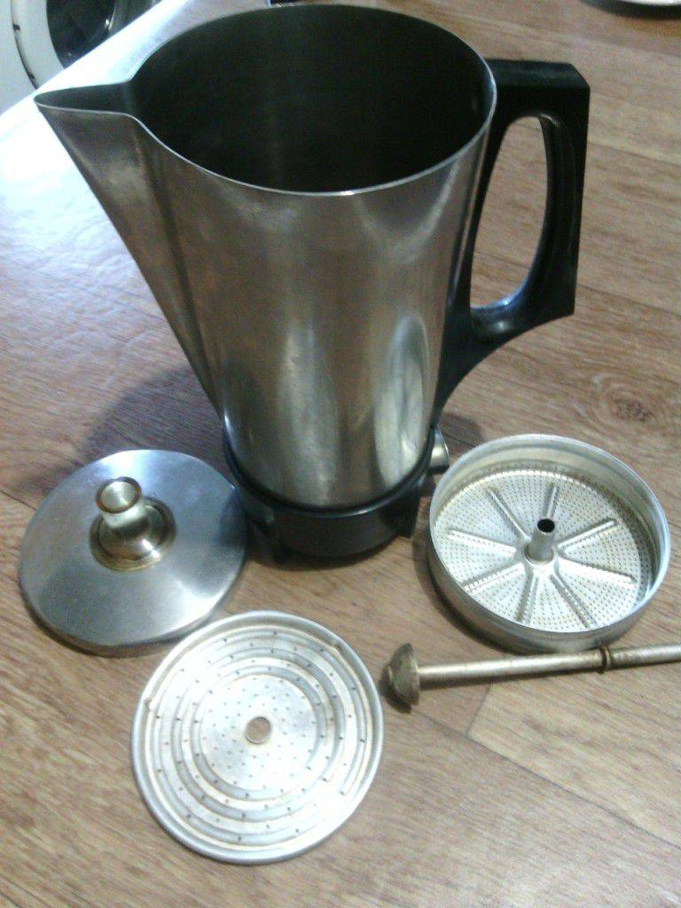
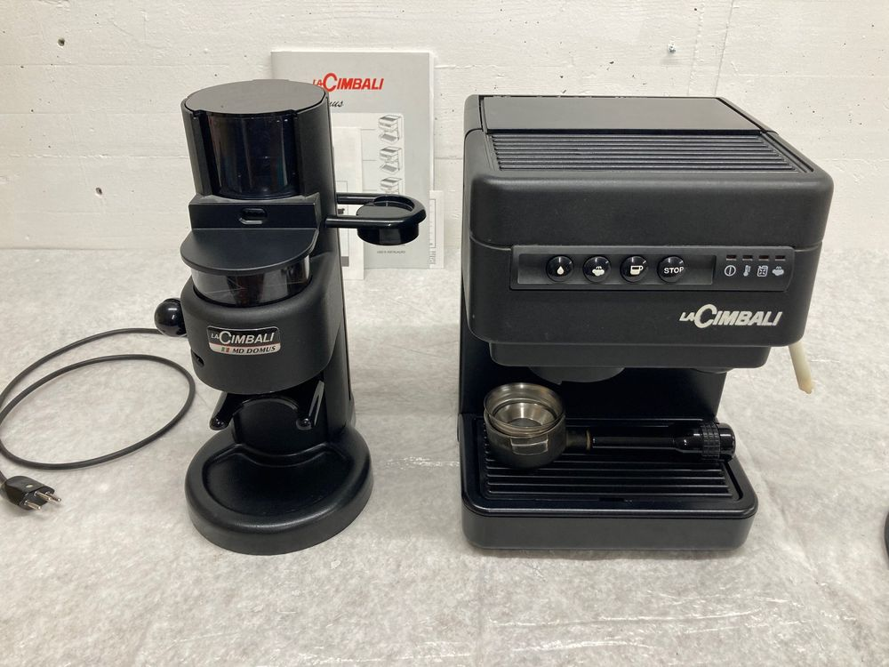
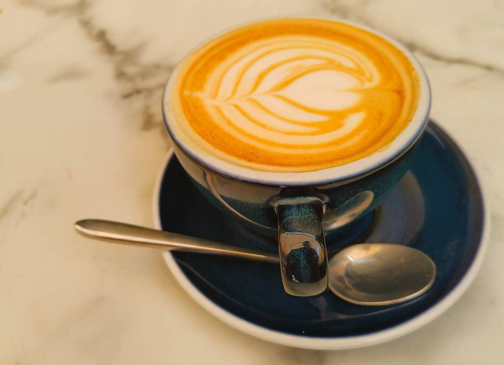

## Сперва был он... Этап первый. Растворимый
Вероятнее всего не у многих изображение в заголовке вызовет ностальгические воспоминания. Большинство, пожалуй, даже не знают такого бренда кофе. У тех, кто из СССР скорее приступ ностальгии вызовет вот это:

А вот у меня... Мой путь в кофе начался именно с него. Дефицитный, должен сказать, продукт по тем временам. И повезло же мне родиться в городе, название которого и красуется на этой банке. Так что формально, выбора у меня не было. Как говорит один мой друг: "Я был обречён на счастье". Счастье вплотную соприкоснуться с данным напитком.

У бабушки дома кофе был всегда. Сладкий, чёрный, с молоком... Всё это частенько сопровождалось кусковым чёрным шоколадом, передаваемым тётушкой со львовской фабрики, или же шоколадными конфетами уже местной "Laima". И это в эпоху ирисок!!! 

Лиепая... Город был пропитан запахом кофе. Из приоткрытых дверей многочисленных кафешек по улицам распространялся такой аромат, что остаться равнодушным было просто невозможно. Там, конечно, варили настоящий, заварной... И смесь этого благородного запаха молотого кофе вперемешку с разнообразным кондитерским флёром создавала просто убойную комбинацию, бьющую в самое сердечко неокрепшего кофейного неофита...

Не припомню уже, в каком возрасте начался этот мой путь, но сейчас уже кажется, что пил я его всегда. Конечно, это был кофе с сахаром. Пожалуй, попробуй я его чистым, такой ранней любви не возникло, но это были те благословенные времена, когда сахар клался в кофе, чай, цикорий, ~~пиво (в гостях - три ложки, дома - одну, а я так любил с двумя)~~, а слова ЗОЖ, junk food, углеводная диета, биохакинг вызывали бы как минимум искреннее непонимание... И конечно же, один из первых доступных юному кофеману рецептов, который хоть как-то отличался от "ложка растворимого кофе, 2 ложки сахара и залить кипятком", было взбивание плотной пенки (сейчас бы сказали "крема"). Это когда в заготовленную смесь кофе с сахаром добавляешь капелюшечку воды и неистово перемешиваешь эту пасту ложкой. И чем она светлее выходит - тем лучше... Помните такое? Вкусовой профит от этих стараний был практически никакой, но визуальный эффект того стоил.

## Этап второй. Заварной
Затем, конечно, наступил период заварной. В кружке "по-польски", в джезве (турке), в гейзерной кофеварке... Хотя, справедливости ради, стоит отметить, что гейзерный тип приготовления заварного кофе в моей жизни таки появился первым. И вот ещё одно ностальгическое изображение для тех, кому за...

Это, конечно же не ваши вот эти вот все Биолетти на 1-2 мензурки. Взрослый сосуд на целую команду любителей залипнуть на целую ночь игры в покер. Именно такие ассоциации вызывает у меня сий девайс: мои родители частенько любили расписать серию партеек в "кубики" с друзьями на ночь. И неотъемлемым атрибутом этих посиделок был, конечно, кофе, сварганенный в подобном агрегате. Юный отпрыск в этих, вне всяких сомнений, увлекательнейших событиях участия не принимал, но их старт, прежде чем отойти ко сну, наблюдал воочию. И подобные недоступно-манящие ритуалы также добавляли желания пить то, что пили эти потрясающие взрослые...

## Этап третий. Экспериментальный
Перенесёмся в уже более сознательный этап моей жизни. До того как вплотную познакомиться с эспрессо, капучино, американо и прочими итальянскими словами, я перепробовал многие способы заваривания. С добавлением  кардамонов, кориц, бадьянов, гвоздик, соли, перца... Неизменным оставалось лишь одно (помимо самого кофе): он был обязательно сладким. Уже тогда я ненавязчиво навязывал культуру потребления сего напитка, повторяя запавшую мне в душу якобы турецкую присказку: **"Настоящий кофе должен быть чёрным как ночь, горячим, как восточный мужчина и сладким, как поцелуй женщины"**

> **Как это звучит на самом деле**
> На самом деле уж не помню откуда я это услышал и насколько сам уже со временем исказил услышанный мною текст, но испытывая потребность не вводить вас в заблуждение, полез в интернет искать первоисточник и выяснил, что "смешались в кучу кони люди..." В этой адаптированной поговорке перемешались 2 фразы. Первая действительно принадлежит турецкому народу и звучит так:
> **«Кофе должен быть черным, как ад, крепким, как смерть, и сладким, как любовь»**
> *(На турецком: Kahve cehennem kadar kara, ölüm kadar kuvvetli, sevgi kadar tatlı olmalı)*
> Вторая же фраза принадлежит знаменитому французскому дипломату Шарлю Морису де Талейрану. Его культовый афоризм звучит следующим образом:
> **«Кофе должен быть черным, как ночь, горячим, как поцелуй, сладким, как грех, и крепким, как проклятие»**

Справедливости ради, стоит отметить, что качество кофе, попадавшего тогда на полки магазинов было не ахти *(впрочем и сейчас - не фонтан, но про это - отдельно)*. А уж знания, как правильно заварить вообще были нулевые. Так, методом проб и ошибок формировался какой-то стиль... И именно сахар нивелировал неизбежную горечь, что сопровождала все эти пробы. А прочие "присадки" добавляли нотки (сейчас это назвали бы "дескрипторы")

## Этап четвёртый. Особенный
Но как-то, в один прекрасный день в моей жизни появилась ОНА!.. Коренная итальянка. Её изящные формы манили, её горячий нрав не оставлял равнодушным. Она умела тихонько урчать, громко рычать и строптиво шипеть. Конечно же я влюбился! А когда, слегка погодя, к ней присоединилась её сестра из той же семьи, моя жизнь никогда уже не была прежней.
Прошу любить и жаловать (фоточка не моя, и у меня кофемашина была белой):

Началась моя совместная жизнь с рожковой эспрессо-кофемашиной  и жерновой кофемолкой. Про их плюсы и минусы, как видов, мы поговорим как-нибудь в иной раз. Пока лишь отмечу, что данный сетап считаю базовым для тех, кто хочет хоть как-то контролировать процес приготовления кофейных напитков на базе эспрессо.
Не счесть, сколько килограммов кофе всевозможных масс-маркетных марок было перемолото и испито. Были отобраны наиболее оптимальные и удалось добиться вкуса "капучины, как в кафе". Уже тогда, благодаря молоку, что заметно смягчал горечь, я стал отказываться от добавления сахара в кофе. Сперва именно в молочных напитках, затем дошла очередь и до американо.
Но даже добившись более-менее адекватного вкуса, сравнимого с кофе в стандартной кофейне, я не мог добиться этого запаха, который не выходил из моей памяти с тех самых, лиепайских детских времён... Конечно, я понимал, что объёмы заваривания, по сравнению с кафе не те, да и килограммы сладостей, разложенных там на полках не оставляли мне никакого шанса, но хотелось же. Хотелось найти тот самый священный кофейный Грааль...
Да и пить просто горький кофе, не закусывая каким-то бутербродом, печенькой или шоколадкой было не очень-то и в удовольствие. Особенно, если он остыл...
## Этап пятый. Откровение
Уже не помню, разочаровался ли я сперва в брендах кофе, поставляемых масс-маркетом, и стал искать кофе, который поставляется в кофейни, либо же младший братишка как-то предложил мне попробовать кофе от знакомого поставщика, и мои глаза открылись... Уже не суть важно. Важно то, что мой кофейный мир ещё раз разделился на "до" и "после".
Вот же! Ну конечно же! Вот этот тот самый запах, который, пусть и выветривается, но ещё какое-то время наполняет кухню после приготовления чашки. Вот тот вкус, который ты можешь ощутить уже лишь в топовых кофешопах, и после которого эти ваши Лаваццы и (о боже) люксовый Илли кажутся "ну такооооое"...
Накнец-то я понял, что значит свежая обжарка, мидл роастед и отобранное зерно... И решил было, что вот он, этот Грааль... Но...
## Этап шестой. Текущий. Корабельно-specialty-roasted
Но затем случился мой отъезд за пределы Украины и моё продолжительное скитание по всему миру в качестве члена экипажа круизных лайнеров. Много откровений я познал с тех пор и немало из них касается кофейной темы. Постепенно некоторыми из них я безусловно поделюсь тут. Но ключевое, к которому и вёл весь этот мой сказ, и который наконец-то отвечает на поставленный в заголовке вопрос: **"Что я имею в виду, когда говорю, что люблю кофе?"** - это открытие отдельного мира **specialty coffee** (произносится **спешилти кофе**). Что это за мир, с чем его едят *(скорее - пьют)*, чем отличается от обычного кофе из кафе и уж тем более от масс-маркета - я расскажу в следующем своём лонгриде (ну или если не желаете ждать этого редкого события - полюбопытствуйте у Гугла). И именно кофе из этого мира (который, к слову, занимает не более 10% от всего мирового рынка) я и имею в виду, когда говорю, что люблю. И именно по этой причине моим друзьям и знакомым, знающим про эту мою маленькую слабость и желающим сделать мне приятное, одарив пачечкой-другой, я настоятельно не рекомендую это делать. Поскольку вероятность дать маху и купить не то - весьма и весьма высока. Уж прастити, "Галя балувана".
## Что в итоге?
Нашёл ли я свой кофейный Грааль? Ну, скажем так: у самурая нет цели, у самурая есть путь. Я не считаю себя кофейным специалистом, до сих пор не нахожу нотки красного винограда или калифорнийской сливы в профиле чашки. Из меня, поставь меня сейчас за барную стойку, выйдет весьма посредственный бариста, не умеющий даже рисовать сердечки носиком питчера. Дай мне профессиональную обжарочную станцию, скорее всего я выдам вам что-то непитейное... Но! Это огромный и увлекательный мир, в котором мне комфортно учиться, познавать и делать новые и новые открытия. И я буду искренне рад, если смогу передать эту страсть, приобщить к этому миру ещё кого-то из вас.

### До новых встреч! ☕